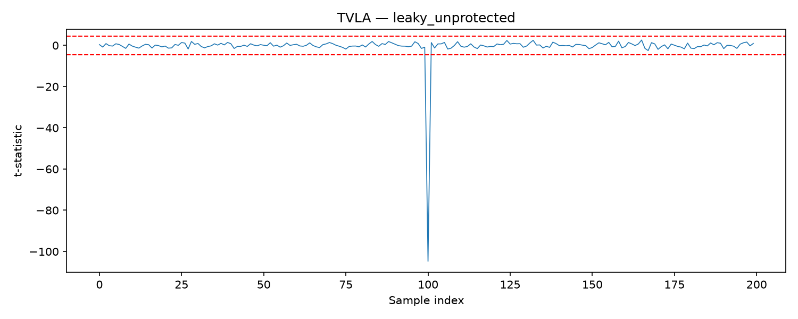
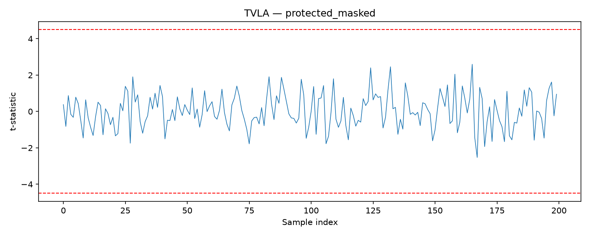

# Snitchwatt

A from-scratch **TVLA (Test Vector Leakage Assessment)** leakage-auditing
toolkit — the name plays on "snitch" (the device gives up its secrets
involuntarily) and "watt" (the unit of power this tool measures leakage
through).

TVLA is the statistical methodology real hardware security labs (e.g.
Riscure) use to answer one question about a cryptographic device: **does
its power consumption depend on secret data, in a way that's statistically
distinguishable from noise?** — without needing to already know the secret
key. That makes it a black-box leakage *scanner*, not a targeted
key-recovery attack: point it at a device's power traces and it tells you
whether *any* data-dependent signal exists at all.

## Current scope: software only

**No physical hardware, no oscilloscope, no target device.** This is
validated entirely against simulated power traces using a standard,
textbook Hamming-weight leakage model with Gaussian noise. The value here
is a correctly-implemented, rigorously-tested statistical engine — not a
claim about real device behavior. See [Limitations & Roadmap](#current-limitations--roadmap)
below for exactly what that means and what comes next.

## How it works

1. Collect (or simulate) two groups of power traces:
   - **Group A ("fixed")** — every trace corresponds to the same fixed
     intermediate value.
   - **Group B ("random")** — every trace corresponds to a different,
     uniformly random intermediate value.
2. For every time-sample index independently, run a **Welch's t-test**
   (unequal-variance t-test) comparing Group A against Group B at that
   sample. This produces one t-statistic per sample — a "leakage trace."
3. **Threshold: `|t| > 4.5`.** If any sample crosses it, the device is
   flagged as leaking. This is the standard, widely-cited TVLA pass/fail
   threshold (≈99.999% confidence the two distributions differ).

## Architecture

```
                 ┌────────────────────────┐
 (NOW)           │   Simulated traces      │
                  │  (Hamming-weight leak   │
                  │   model + Gaussian      │
                  │   noise, configurable)  │
                  └───────────┬─────────────┘
                              │
 (LATER, deferred —           │            same interface
  real oscilloscope /         ▼
  ChipWhisperer      ┌──────────────────────┐
  captures plug       │  Trace loader         │  <- io_utils.py already
  in here without      │  (io_utils.py)        │     accepts .npy / .csv,
  changing anything     └───────────┬───────────┘     so real captures drop
  below)                            │                  in later with zero
                                     ▼                  changes to the engine
                       ┌──────────────────────┐
                       │   TVLA engine          │
                       │   (Welch's t-test,      │
                       │    fixed-vs-random)     │
                       └───────────┬───────────┘
                                   │
                                   ▼
                       ┌──────────────────────┐
                       │  Report generator      │
                       │  (pass/fail, plots,     │
                       │   report-card across    │
                       │   multiple profiles)     │
                       └──────────────────────┘
```

The trace source is abstracted from day one — `tvla.py` and `report.py`
never know or care whether traces came from `simulate.py` or a real
oscilloscope capture file.

## Install & usage

```bash
pip install -r requirements.txt
python examples/demo.py
python benchmark/run_profiles.py
pytest
```

`examples/demo.py` simulates a leaky and a protected profile, runs TVLA on
both, and saves plots + printed summaries.

## Demo output

**Leaky (unprotected) profile** — clear threshold crossing at the leaking
sample:



**Protected (masked) profile** — no sample crosses the threshold:



## Report card

`benchmark/run_profiles.py` runs TVLA across four simulated device profiles
to demonstrate the tool captures *degree* of leakage, not just a binary
result:

| Profile | Verdict | max \|t\| | Notes |
|---|---|---|---|
| `unprotected_high_snr` | FLAGGED | 129.96 | Obviously broken implementation, strong leak. |
| `unprotected_low_snr` | FLAGGED | 5.44 | Borderline case: weak but real leak, tests detector sensitivity. |
| `masked_implementation` | PASS | 3.34 | Clean countermeasure, no data-dependent component anywhere. |
| `masked_implementation_with_residual_leak` | FLAGGED | 4.98 | Imperfect countermeasure: small residual leak survives masking. |

Both unprotected profiles are flagged, the clean masked profile passes, and
the masked-with-residual-leak profile is flagged but with a visibly smaller
max \|t\| than the fully unprotected profiles.

## Package layout

- `snitchwatt/tvla.py` — Welch's t-test core + pass/fail evaluation. No
  knowledge of trace origin, no plotting.
- `snitchwatt/simulate.py` — synthetic Hamming-weight trace generator. No
  statistics, no plotting.
- `snitchwatt/report.py` — plots and text summaries from TVLA output. No
  statistics computed here.
- `snitchwatt/io_utils.py` — `.npy` / `.csv` trace loaders. The seam where
  real hardware captures will plug in later, unchanged.
- `examples/demo.py` — end-to-end demo.
- `benchmark/run_profiles.py` — report-card layer across simulated device
  profiles.
- `tests/test_tvla.py` — pytest suite covering the engine and the
  simulator/engine round trip.

## Current Limitations & Roadmap

- **This currently runs on simulated traces only.** No real hardware has
  been tested. The leakage model (Hamming weight + Gaussian noise) is a
  standard textbook approximation used to validate the *analysis logic*,
  not a hardware-validated model of real device behavior.
- **Next step — hardware integration (deferred, not yet started):** a
  ChipWhisperer-Nano capture module (`capture/`) will talk to real target
  firmware under the same fixed-vs-random protocol already implemented
  here, and save traces via the same `.npy` format `io_utils.py` already
  reads. The TVLA engine, report generator, and benchmarking layer require
  **zero changes** to consume real traces instead of simulated ones — that
  abstraction seam is the entire point of the current architecture. See
  `ROADMAP.md` §8 for the full plan.

## References

- Goodwill, G., Jun, B., Jaffe, J., & Rohatgi, P. (2011). *A Testing
  Methodology for Side-Channel Resistance Validation.*
  https://icmconference.org/wp-content/uploads/A16aGoodwilGl.pdf
- Becker, G., Cooper, J., DeMulder, E., Goodwill, G., Jaffe, J.,
  Kenworthy, G., Kouzminov, T., Leiserson, A., Marson, M., Rohatgi, P., &
  Saab, S. (2013). *Test Vector Leakage Assessment (TVLA) Methodology in
  Practice.*
- ISO/IEC 17825 — Testing methods for the mitigation of non-invasive attack
  classes against cryptographic modules.

## License

MIT — see [LICENSE](LICENSE).
